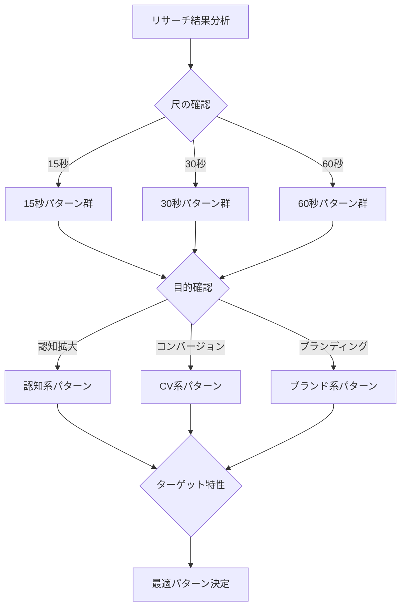

# 動画広告パターン選択ガイド

このファイルは、リサーチ結果に基づいて最適な動画パターンを選択するためのガイドです。

## 目次
1. [パターン選択の判定基準](#パターン選択の判定基準)
2. [自動推奨ロジック](#自動推奨ロジック)
3. [パターン別特徴マトリクス](#パターン別特徴マトリクス)
4. [カスタマイズガイド](#カスタマイズガイド)

---

## パターン選択の判定基準

### 1. 尺による判定

#### 15秒動画
```
推奨パターン:
- Problem-Solution-CTA型
- インパクト重視型
- オファー訴求型

選択基準:
- 認知度が低い商品 → インパクト重視型
- 緊急性の高い課題 → Problem-Solution-CTA型
- 期間限定オファー → オファー訴求型
```

#### 30秒動画
```
推奨パターン:
- ストーリーテリング型
- デモンストレーション型
- Before/After型

選択基準:
- 感情に訴える商品 → ストーリーテリング型
- 機能性重視 → デモンストレーション型
- 変化が視覚的 → Before/After型
```

#### 60秒動画
```
推奨パターン:
- ブランドストーリー型
- 導入事例型
- 教育コンテンツ型

選択基準:
- ブランド構築 → ブランドストーリー型
- B2B商材 → 導入事例型
- 複雑な商品 → 教育コンテンツ型
```

### 2. 目的による判定

#### 認知拡大
```
優先要素:
- 記憶に残るフック
- ブランド名の露出
- シンプルなメッセージ

推奨パターン:
15秒: インパクト重視型
30秒: 問題提起型
60秒: ストーリー型
```

#### コンバージョン
```
優先要素:
- 明確なベネフィット
- 信頼性の証明
- 強力なCTA

推奨パターン:
15秒: オファー訴求型
30秒: デモンストレーション型
60秒: 導入事例型
```

#### ブランディング
```
優先要素:
- 価値観の共有
- 感情的つながり
- 世界観の構築

推奨パターン:
15秒: コンセプト提示型
30秒: 価値観共有型
60秒: ブランドストーリー型
```

---

## 自動推奨ロジック

### リサーチ結果からの判定フロー



### スコアリングシステム

各パターンに対して以下の要素でスコアリング：

```
商品特性スコア（40点）:
- 認知度レベル（0-10点）
- 価格帯適合性（0-10点）
- 購買頻度（0-10点）
- 差別化度（0-10点）

ターゲット特性スコア（30点）:
- 年齢層適合（0-10点）
- 課題意識レベル（0-10点）
- デジタルリテラシー（0-10点）

配信環境スコア（30点）:
- プラットフォーム適合（0-10点）
- 音声環境対応（0-10点）
- 視聴環境適合（0-10点）

合計100点満点で最高スコアのパターンを推奨
```

---

## パターン別特徴マトリクス

### 主要パターン一覧

| パターン名 | 最適な尺 | 適した商材 | ターゲット | 強み |
|-----------|---------|-----------|-----------|------|
| Problem-Solution-CTA | 15-30秒 | 課題解決型 | 課題顕在層 | 即効性 |
| ストーリーテリング | 30-60秒 | ライフスタイル | 感情重視層 | 共感性 |
| デモンストレーション | 30秒 | 機能性商品 | 論理重視層 | 説得力 |
| Before/After | 15-30秒 | 変化明確 | 結果重視層 | 分かりやすさ |
| テスティモニアル | 30-60秒 | 高額商品 | 慎重派 | 信頼性 |
| インパクト重視 | 15秒 | 新商品 | 若年層 | 記憶定着 |
| オファー訴求 | 15秒 | 期間限定 | 価格重視層 | 行動喚起 |
| ブランドストーリー | 60秒 | 高級品 | ブランド志向 | 価値観共有 |

### パターン別構成要素

#### Problem-Solution-CTA型
```
構成比率:
- 問題提起: 30%
- 解決策提示: 50%
- CTA: 20%

必須要素:
- 共感を呼ぶ課題設定
- 明確な解決メカニズム
- 簡単な次のステップ
```

#### ストーリーテリング型
```
構成比率:
- 状況設定: 20%
- 展開: 50%
- 解決: 20%
- CTA: 10%

必須要素:
- 主人公の設定
- 感情的な変化
- ブランドとの自然な統合
```

---

## カスタマイズガイド

### パターンの組み合わせ

複数パターンの要素を組み合わせることも可能：

```
ハイブリッド例:

1. Problem-Solution + テスティモニアル
   - 前半で課題と解決策を提示
   - 後半で実際の利用者の声

2. ストーリー + デモンストレーション
   - ストーリーの中で自然に機能を紹介
   - 感情と論理の両方に訴求

3. Before/After + オファー
   - 変化を見せた後に限定オファー
   - 視覚的インパクトと行動喚起
```

### 業界別カスタマイズ

#### IT/SaaS
```
推奨調整:
- デモ要素を強化
- ROI数値を明示
- 導入の簡単さを強調
```

#### 美容/健康
```
推奨調整:
- ビジュアル重視
- 実績/証明を前面に
- 感情的ベネフィット
```

#### 教育/学習
```
推奨調整:
- 成長ストーリー
- 具体的な成果
- サポート体制の明示
```

### プラットフォーム別最適化

#### YouTube向け
```
調整ポイント:
- 最初の5秒を最重要視
- 音声ありを前提に構成
- 関連動画からの流入を意識
```

#### Facebook/Instagram向け
```
調整ポイント:
- 音声なしでも理解可能
- 正方形/縦型フォーマット
- 3秒でフック完成
```

#### TikTok向け
```
調整ポイント:
- ネイティブ感のある演出
- 縦型フルスクリーン
- トレンド要素の組み込み
```